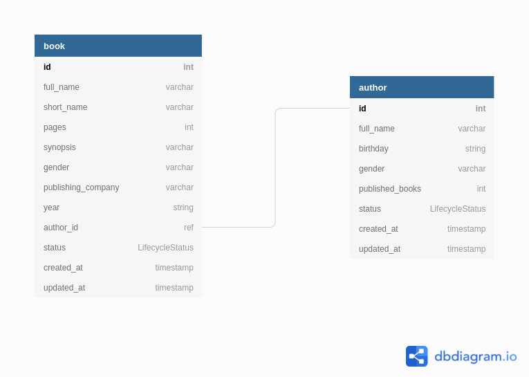

## Mini-Biblioteca
Desafio 01 - Sistema de cadastro e gerenciamento de livros e autores em uma biblioteca.

Tem como objetivo simular um sistema de cadastro e gerenciamento de livros de uma biblioteca, permitindo assim a visualização, inserção, alteração e exclusão de qualquer livro ou autor.

## Características do Sistema

### Livros
- Buscar todos os livros (ativos ou deletados)
- Buscar um livro 
- Cadastrar um novo livro
- Atualizar um livro
- Deletar um livro

### Autores
- Buscar todos os autores (ativos ou deletados)
- Buscar um autor
- Cadastrar um novo autor
- Atualizar autor
- Deletar autor


## Regras de negócio

### Livros
- Livros podem ser modificados por qualquer um
- Cada livro pode ter somente um autor

### Autores
- Autores podem ser modificados por qualquer um
- Um autor pode conter vários livros


## DB MODEL


```sql
Enum LifecycleStatus {
  ACTIVE
  DELETED
}

table book {
  id int [pk, increment] // auto-increment
  full_name varchar
  short_name varchar
  pages int
  synopsis varchar
  gender varchar
  publishing_company varchar
  year string
  author_id ref
  
  status LifecycleStatus

  created_at timestamp
  updated_at timestamp
  }
  
table author {
  id int [pk, increment] // auto-increment
  full_name varchar
  birthday string
  gender varchar
  published_books int
  
  status LifecycleStatus

  created_at timestamp
  updated_at timestamp
}


Ref: "author"."id" < "book"."author_id"